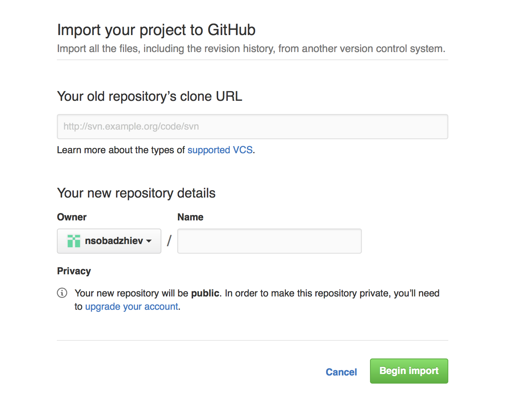

# How to convert to open source

This article is going to be about turning a pile of **code** you wrote for whatever reason, into **open source code**.


There are surprisingly a lot of things to think about when open sourcing your project. Of course, you can just take your code as-is and upload it to GitHub, but what's the fun in that. We will look into the reason to do some additional work around open sourcing later, so lets leave for now.

For this particular article, we will focus on the technical logistics, namely:
* Transfering the repo
* Looking into dependencies
* Project metadata

### Transfering the repo (Git)

The obvious thing in open sourcing your project is uploading your code to a place people can see. You can always expose the repository you're already using to the world, if it is self hosted (you are using a repository, right...RIGHT?). But does it really make sense. For better or for worse, the de facto standard in open source hosting nowadays, is GitHub. So it makes sense to leverage its massive exposure and social features and give your project the best chance to get popular. And as much as I like to be a hipster about things like this, I think the GitHub is an excellent option and would highly recommend it.

GitHub has extensions for SVN and other source control management systems at this point, but it mainly promotes git. And since I'm using git on daily basis, I'm going to focus on that.

As far as I'm concerned, there are three ways to achive that - the easy way, the hard way and the lame way.

#### The easy way

The easy way is to use the power of GitHub. They have a wizard for importing an exisitng repository, be it SVN, GIT or TFS.

-----
Who is TFS???
It's a [source control management software build by Microsoft][TFS wiki link].

----- 

Basically, you input the path to your previous repository, set the project name and start importing... Super easy!



#### The hard way

-----

Q: Why are you reading this when there's a Gibhub wizard that's much easier to use?
A: Because you're a nerd...Nerd!

-----

For the hard way, we shall delve deeper into git commands. Yes, wizards are cool, but it's sometimes nice to know how to do stuff "with your own hands". Also, going this path, we will not have to clone a new repository or change our working directory (much). We will add another **remote** to our existing local repository, which is going to point to GitHub. Then we will say that this is the default push location so that we don't have to always remember to specify a new location when running `git push`.

It is becoming a bit of a git tutorial, but lets try it. Check out this snippet:

```
$ git remote add other path/to/new/repository.git
$ git push other master
Counting objects: 3, done.
Writing objects: 100% (3/3), 235 bytes | 0 bytes/s, done.
Total 3 (delta 0), reused 0 (delta 0)
remote: error: refusing to update checked out branch: refs/heads/master
...
remote: error: 'receive.denyCurrentBranch' configuration variable to 'refuse'.
To path/to/new/repository.git
 ! [remote rejected] master -> master (branch is currently checked out)
error: failed to push some refs to 'path/to/new/repository.git'
$ cd path/to/new/repository.git
$ git checkout -b develop
$ cd back/to/first/repo
$ git push other master
Counting objects: 3, done.
Writing objects: 100% (3/3), 235 bytes | 0 bytes/s, done.
Total 3 (delta 0), reused 0 (delta 0)
To path/to/new/repository.git
 * [new branch]      master -> master
```

We can see several things here. First of all, we add a "remote" to our local git repository (this means the one on your computer that you actually use for development, not the server you probably use to store your code). Essentially, this is telling git that there is another repository you will be interacting with.

After that, we can attempt to push our stuff to the new location. And what happens in this snippet, is that an error occurs. It doesn't happen all the time. In fact, if you will be pushing your code to GitHub it will certainly not. This is a specific case when you try to push to a repository that is not **bare**. For instance, you create a non-bare repository by typing `git init name path/to/repo`. On the other hand this - `git init --bare name path/to/repo`, creates a bare one.

The difference is that a bare repository doesn't have a working directory. It's ideal for a central location to store the work of all your developers (for instance GitHub). Which brings is to the actual error that we saw. Git was actually complaining that in the remote location, the master branch exists and it is checked out. So it is a bit concerned that if it pushes there, some changes might get lost. A solution to that error is either to make sure the remote repository is bare, or switch to a branch that's not the one you're pushing into. For instance, you might create a new branch and switch to it. This is exactly what the following part of the snippet does:

```
$ cd path/to/new/repository.git
$ git checkout -b develop
$ cd back/to/first/repo
$ git push other master
```

After this is executed, you should be able to see your exiting commits (only the ones in the branch you pushed) in the new repository.

#### The lame way

I guess the easiest way to do it for some people is to create the new repository and copy the existing project files in it. And surely, it works 100%. The only problem is that you lose all the commit history you reviously had.

And yes, even though this section is called "The lame way", it might be a viable option for many projects. For instance if you didn't have any history in the first place. Or more importantly, you might not want to share your commit history with others.

### Handling dependencies

Unless you're building something small and/or are a purist that doesn't like to use other people's code if he can write it himself, chances are your project has at least one dependency. And by "dependency" I mean a third party library, an internal project or someone else's code altogether. It is also quite likely that those dependencies are open sourced. And now that you're, in turn, releasing your code into the wild, it is time to think about dependencies in a more flexible way.

The easiest way to start using someone else's code, is surely to copy it in your project tree. But that poses some issues, especially with modularity and code reuse. How do you differentiate between your code, and the third party code. What happens if the author of that code updates it and you have to merge the changes? It's pretty clear that separating this module from the core project will be beneficial at some point. And there are numerous ways to achieve that. Depending on your platform, there's always a way for your IDE or programming language to combine several projects in a workspace. And I'm sure you know it, so use it!

It is often possible to build a framework or a library and just import and link that. It's a good option, but you can run into problems with your source control management system. And on the topic of source control, we can now ease into git submodules. Git submodules are awesome! With them, you let git know that your project depends on another project. You specify where its git repository is and which revision you wish to use and git can start tracking that relationship. If you don't know about git submodules, you should definitely read about it.

Back to the point of open sourcing, you should really start using submodules before releasing your code to the public - it just makes it so much easier. Either way, most of the third party modules that you use are written by you (or your company) or are open source. For both cases, it is nice to declare them as dependancies of your project. That way, if one of those modules is updated, you can easily test that the change works for you and update. Then, all the people that potentially use your code, can also update with a push of a button.

Also, imagine that you are using an XML parser, but you only copied the cource files to your peoject because it's easier. If someone decides to incorporate your code inside his project, a collision might occur. It is possible that he is also using the same XML library. So now he has to remove the duplicating code and figure out how to compile successfully again. Not a very friendly open source experience.

In general, try to make your code as reusable as possible. And never assume any use case, because you never know how people would be using it. After all, that really is the essence of open source - being reusable. The more concise and modular your code is, the less people have to modify it to make it suitable for their needs. So **be a good open source citizen and help others understand your code easier**

### Project description

Even though they are developers, people who will be viewing and potentially using your code are still quite lazy and picky. They love flashy things and projects that look polished and pretty. A good README with a lot of images and examples goes a long way. It shows professionalism and care. And also a few words about the code really save a lot of time trying to understand it.

Achieving that is also not really hard, so you have no excuss not to do it. For consumer products you need websites, videos and colorful graphics, but in the developer world, a good README goes a long way. Just opening the GitHub page for a project, makes that file prominent and serves as a landing page for your work. The de-facto standard for formatting a README is [Markdown][Markdown wiki]. Markdown is a really simple laguange for styling text. It lets you focus on content with minimal regard to formatting. It's universal, cross platform and much easier than HTML. In fact, this is exactly what I'm using right now writing this article. I'm purely focusing on the content and diregarding the visiolization of the text. Later, when the text is complete, I will switch to styling and choose fonts, color and page templetes. And it's not just me, many other authors and bloggers are turning to Markdown for their publishing needs.

Moving towards the contents of your README file, there are several items, questions, that you should answer in the text:
* What is this project about?
* What features does it have?
* What is the technology it is running behind?
* What dependencies does it have?
* How can it be installed and run?
* What license is it released with?
* Examples?
* Contributing rules?

Most of these item are fairly straight-forward. Of course you need to explain what this project is, and what language/platform it is intended for. One side note is that for full applications, and for user facing frameworks, it is really helpful to include pictures or gifs showing your code in action. And if it's just a utility library or a chunk of code, you wish to share, an example or a code snippet also goes a long way. For instance, if I'm searching a library of cool animations, I'd much rather see them in action immediately than have to clone and run a whole project to see of it fits my requirements.

Secondly, I cannot stress enough that you need to be explicit with any dependencies you have. Many developers might not care that you're improrting 10 other libraries, but the good and experienced ones will carefully consider if they want to inherit your dependencies list. And as a general rule, don't force other people to use yet another framework, unless you have to. I had a problem recently with a third party framework I was using. They made a major refactoring release. There, they decided to import a fairly big and complex logging framework ([The Cocoa Lumberjack framework][Lumberjack github page]) in order to improve their debugging abilities. I didn't have anything against Lumberjack, but in my opinion it was too complex and big for my needs. Additionally, I had my own logging solution so I was reluctant to import it into my workspace. So in the end, I had to change the frameworks's code to exclude Lumberjack as a dependency. This was especially frustrating since something like this could have easily been extracted into an interface, giving other developers the opportunity to swap logging implementations. But again, this is the beauty of open source - if you need it, fork it and implement it.

Maybe the second most important task to accomplish in a README, are good steps for installation and usage. Remember that others didn't write the code and they sometimes have no idea what they need to do in order to successfully use your code. So take a few minutes to explain your setup and assumptions. Or even better, setup the project in a way that has minimum extra work to run on a different machine.

Something that is obviously missing in the list above, is documentation. And lets face it... if few people write documentation, even fewer read it. In fact, I think most of the time a good examples page or a sample application work way better. A prime example of that is the [CorePlot framework][CorePlot GibHub] for iOS and Mac. But we will talk about that in the [iOS/Mac open source world article][open source world article link].

[TFS wiki link]: https://en.wikipedia.org/wiki/Team_Foundation_Server
[Markdown wiki]: https://en.wikipedia.org/wiki/Markdown
[Lumberjack github page]: https://github.com/CocoaLumberjack/CocoaLumberjack
[open source world article link]: NA
[CorePlot GibHub]: https://github.com/core-plot/core-plot