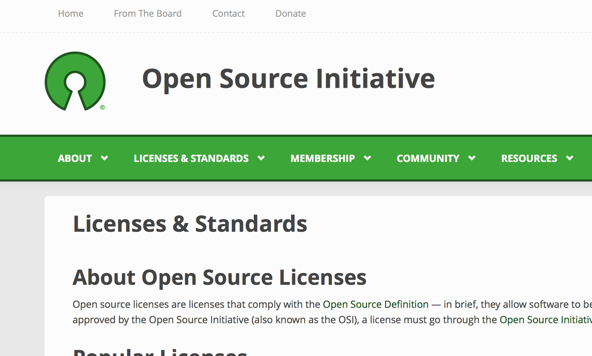

## Open source licenses

This article is about the different available open source licenses and how to choose the one you're comfortable with.

### Licensing

As a developer, trying to give something back to the community, the first encounter with open source licenses can be overwhelming. There seems to be an endless selection to choose from and it can sometimes be difficult to distinguish between options. Of course, you can alway make your own license, but I'm going to assume most people don't have the expertise and/or the desire to do so. Leave it to corporations.

The number one thing you should be interested in when choosing a license is how open you want your code to be. More specifically, what are the rules others need to follow if they want to use and/or modify your code.

#### Commonly used licenses

What better way to explore the world of open source licenses, than going back to the origin - The [Open Source Initiative][OSI link]. Heading over to the licenses section of this website, we can see a number of "popular" options.

Here's the list at the time of writing:
* Apache License 2.0
* BSD 3-Clause "New" or "Revised" license
* BSD 2-Clause "Simplified" or "FreeBSD" license
* GNU General Public License (GPL)
* GNU Library or "Lesser" General Public License (LGPL)
* MIT license
* Mozilla Public License 2.0
* Common Development and Distribution License
* Eclipse Public License

What you might find strange here is that you can see company names. As mentioned, you are free to create your own terms, if you have the money and expertise to do that. So some big companies, like Mozilla in this case, do that, but for most people choosing an existing one is fine.

### Choosing a license

If you read around the OSI website a little bit, and open the page for some of the licenses shown above, you will notice that, even though it is legal text, it's not really hard to read. And quite short. For instance, the Apache License has 9 relatively short sections. So I encountage every single one of you to actually read at least the most popular ones.

When choosing a license, there are mostly several things to think about.

First, and definitely most important, are the rules for using the code (and any documentation, configurations files and whatever else you have there). What are the rules, other developers need to obey, if they want to use your hard work. Surely, since you open sourced your code, you welcome people to enjoy it, but still you need to decide how open you want to be about this. For instance, the MIT license, which is a popular choice for "liberal" developers, permits almost every kind of usage scenario. The only thing you cannot do, is claim the code is actually yours. On the other hand, the GNU General Public License allows you to use and change the source, but only if you, in turn share your code and any changes you might have made. So basically this limits the projects appeal for commercial products. It is a fairly popular choice in the Linux world, where people promote free and open software.

Most of the other text within a open source software license is about liability and contribution. Here, there is less to choose since most options are relatively the same. They tend to disclaim any sort of liability obligations. And for good reason. You were happy to share your work with the world, but do you really want to be held responsible for problems that might arise in other people's projects? Probaby not. So OSI comes to the rescues and makes sure you don't run into those kinds of problems.

Another liability topic, licenses handle in a similar way, are contributions. If you share your code with others, the best this that could happen is to start getting code back in the form if bug fixes and features. And surely, you think that's great. But what does your lawyer think? What if tomorrow someone claims that their code is in your project so they should have a piece of the fame? Thankfully, open source licenses don't allow that. All popular ones claim that contributions that you might get are free of charge and are yours for the taking.

_Something cool I found in some licenses (The Apache), is section 9 called "Accepting Warranty or Additional Liability". It allows you to bring support and consulting to your business model for open source projects. This is something that many companies like Canonical and RedHat already do. It means that whereas the code is free, not providing any type or warrenty, and might actually not allow you to used in commercial project (not the case with Apache), you can still charge money in exchange for support and accepting warrenty._

So the elephant in the room of choosing a license is actually what we discussed in the first paragraph - do you want people to start using your code for profit. It's to some degree a philosophical question, but also your decision might change from project to project. What I'm seeing in other people, and it also happens to be my personal opinion, is that for small projects and pieces of code, you should choose a more "liberal" lisense. The MIT license for instance, is a great choice in that matter. The truth is, if your project is just a few files of code, who cares if it's used by an evil corporation. And even if you protect it with a strict license, like GPL (General Public License), the code base is so small, a developer can re-write it base on your ideas and solutions. For bigger projects, however, let's say for frameworks and whole applications, you might have to weigh in your options more carefully. If you're building this product just for fun, think about it in a "political" way. Do you accept that people might be profiting using your work, without giving anything back? Are you a strong supporter of open source? And if you're trying to run a business with that code base, can other companies levarage that in order to gain a competitive advantage over you? Can they use your code, extend it a little without in turn sharing their modifications, to take the upperhand? If so, then a more permissive lisense might not be a good choice for you.

Anyway, based on how liberal they are towards commercial use, the popular lisences you can see on OSI's website, can be divided in two:

#### Open to commecial use

* MIT license
* Apache License 2.0
* BSD license
* Eclipse Public License
* Mozilla Public License 2.0
* Common Development and Distribution License

#### Open source only

* GNU General Public License (GPL)

------

**Note:** Saying "Open to commercial use", doesn't mean you cannot use a GPL license for commercial products. It just means that if you incorporate a GPL licensed project in your own, you need to also open source any modification you make to the code base and the way it's used. Surely, there a lot of loopholes, but generally, that's the rule. And that's what makes it often unsuitable for commercial products.

------

Digging deeper, beyond distribution terms, most licenses seem similar to the common programmer. I encourage you to read those licenses to see how they differ, but generally, after you choose between those two sections above, you're almost ready. 

But before we move on to "Applying the license", there are several interesting topics many licenses address. One of them, that addresses the so called "privacy loophole", makes sure cloud services cannot bypass their responsibility towards your code. Since many options are fairly old (GPL v1 for instance was created in 1989), they don't address hosted services. Many companies go around strict licenses by saying that they don't distribute the protected source code - they just deploy it once internally, and then provide it to users as a SaaS (Software as a Service). Since this is not exactly fair and sometimes unacceptable for the authors, several licenses address that issue, namely:
* Affero GNU Public License
* Common Public Attribution License 1.0
* Non-Profit Open Software License 3.0
* Open Software License 3.0
* Reciprocal Public License 1.5

Another interesting topic is the way third parties should acknowledge their use of open source software. Normally, the rule is that you should distribute a copy of the license with your product, but that doesn't mean it needs to be easily accessible. However, authors might choose a license that makes other developers acknowledge their ue of the open source code in a user accessible place within their software (most likely somewhere in the UI). That's called **enhanced attribution**. This time the options are:
* Adaptive Public License
* Affero GNU Public License
* Attribution Assurance Licenses
* Common Public Attribution License 1.0
* Reciprocal Public License 1.5

Finally, a consideration that I wish anyone of us had, is the **no promotion** feature. It protects authors from being used as advertisement for a product. It forbids 
third parties to use the author's name to promote their business.

What you go for is largely a matter of choice. For instance, if I wanted to just share some code with other people, I'd use MIT or BSD, since they are so simple and short.

And if I ever release a framework or an application I want to protect better, I'd go for GPL. However, as a disclaimer, I'd like to say I'm no expert so I might be missing something. For best results, just read the different options and make your own choice.

#### Where to go from here?

An excellent resource for choosing between open source licenses, is the [OSS Watch Licence differentiator][OSS license diff link]. There, you can input up to 7 parameters for your particular case and it will give you a list of licenses that that suitable for what you are trying to achive. I recommend that go go check it out. Just explore a little, start playing with the values and you'll become a open source pro!

### Applying a license

When I wanted to release some code "to the wild" for the first time, and I thought about licensing, I started wandering how I can obtain one. Surely, if you want a ligally binding doocument for your project, you need to talk to someone. At that point, several years ago, I remember it wasn't plainly obvious how you can apply a license to your code. A simple search didn't yield any useful answers immediately. But soon enough, I found it. The only thing you need to do is... specify which license you're using somewhere in your project.

Also, if you look into any of the license pages at [OSI][OSI link], you will see at the bottom a should appendix explaining how to apply the license to your code.

> APPENDIX: How to apply the Apache License to your work

> To apply the Apache License to your work, attach the following boilerplate notice, with the fields enclosed by brackets "[]" replaced with your own identifying information. (Don't include the brackets!) The text should be enclosed in the appropriate comment syntax for the file format. We also recommend that a file or class name and description of purpose be included on the same "printed page" as the copyright notice for easier identification within third-party archives.

>   Copyright [yyyy] [name of copyright owner]
   Licensed under the Apache License, Version 2.0 (the "License");
   you may not use this file except in compliance with the License.
   You may obtain a copy of the License at

>     http://www.apache.org/licenses/LICENSE-2.0

>   Unless required by applicable law or agreed to in writing, software
   distributed under the License is distributed on an "AS IS" BASIS,
   WITHOUT WARRANTIES OR CONDITIONS OF ANY KIND, either express or implied.
   See the License for the specific language governing permissions and
   limitations under the License.

I guess at some point GitHub (the popular hosted repository website) realized as a major problem that developers didn't know to apply a license to their code and added a license selection step to their "new project" wizard.

To summarize, the only thing you need to do in oder to apply a license to your project is to add that text somewhere in your code. Most of the time, it means adding a LICENSE.txt file to your project and maybe add a comment to the begining of your source code files. For the actual text, refer to your license of choice's webpage.

### Importing other people's code

What about the opposite? If you had a library you wanted to use, what do you need to do to acknowledge the authors?
Well, normally you need to specifically state that you're using someone else's code. And also add their `LICENSE` and `NOTICE` files. However, not many people realize, this doesn't need to be that complicated.

As already discussed above, as long as the code is not proctected by a license with an **enhanced attribution** policy, all the law says is that these things need to be shipped with the actual product. So for mobile appilication, it is enough to put those files in the package that you upload to (and people download from) the Store. Yes, it's not easily accessible, but a copy of all that **is** included in the product. Also, many applications choose not to include the actual acknowledgements for open source code that they are using, but to provide a link to their website where they enumerate all the projects and authors.

[OSI link]: https://opensource.org/
[OSS license diff link]: http://oss-watch.ac.uk/apps/licdiff/